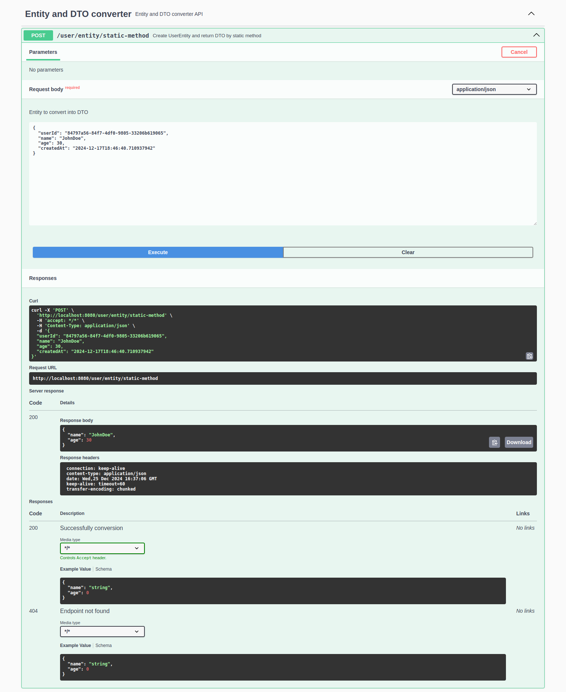

# Entity to DTO Converter
This project is designed to explore and test different approaches for converting Entity objects into DTOs and vice versa.
It demonstrates several methods for achieving this goal in a Spring Boot application.

## Implemented Approaches
The following methods for entity-to-DTO conversion are implemented:

- **Constructor**: Directly using constructors in DTO classes.
- **Static Method**: Utilizing static factory methods for conversion.
- **@Builder (Lombok)**: Leveraging Lombok's @Builder annotation for building DTOs.
- **Manual Mapper**: Writing custom mapper classes for conversion.
- **MapStruct**: Using the MapStruct library for automatic mapping.
- **Spring Data JPA Projection**: Utilizing JPA projections to create DTOs directly from queries.

## Project Details
- **Java Version**: Java 23
- **Frameworks**: Spring Boot 3, JUnit 5
- **API Documentation**: Swagger UI

## How to Run
1. Clone the repository:
```gitexclude
git clone https://github.com/angelicamarttins/entity-dto-converter
cd entity-dto-converter
```
2. Start the application:
```gitexclude
./gradlew bootRun
```
3. Open your browser and navigate to:
```gitexclude
http://localhost:8080/swagger-ui/index.html
```
4. Explore the endpoints:
- Select an endpoint;
- Click on `Try it out`;
- Modify the request payload if needed;
- Click `Execute` to see the response.


